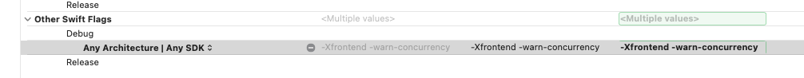
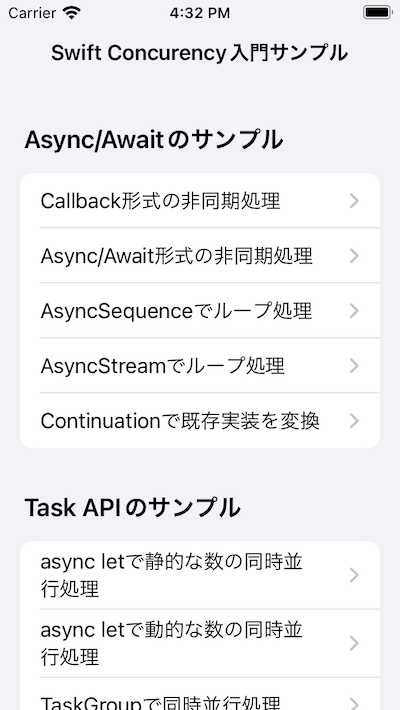
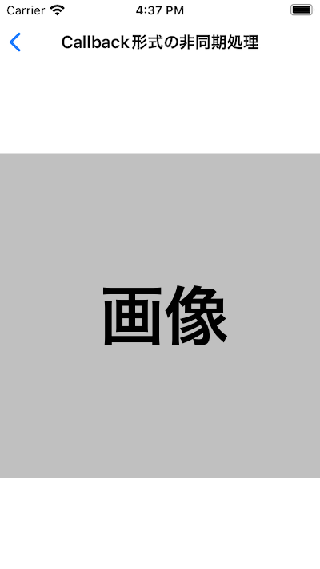

# WEB+DB PRESS Vol.126 iOS 15特集 「Swift Concurrency入門」 サンプルコード

技術評論社刊「WEB+DB PRESS Vol.126」のiOS 15特集「Swift Concurrency入門」のサンプルコードです。

## 動作検証環境

Swift 5.5
Xcode 13.0
iOS15.0

※ Build Settings > Other Swift Flagsに`-Xfrontend -warn-concurrency`を設定しています。

## 使用API

検証用のデータに下記のAPIを利用しています。

- [Dog API](https://dog.ceo/dog-api/)
- [RANDOM.ORG](https://www.random.org/integers/)

## プロジェクト構成

本章で紹介したコードを画面ごとに実行できるようにしています。下記の項目が確認できます。

- Async/Awaitのサンプル
  - Callback形式の非同期処理
  - Async/Await形式の非同期処理
  - AsyncSequenceでループ処理
  - Notification(AsyncSequence)から継続的にデータを受信
  - AsyncStreamでループ処理
  - Continuationで既存実装を変換
- Task APIのサンプル
  - async letで静的な数の同時並行処理
  - async letで動的な数の同時並行処理
  - TaskGroupで同時並行処理
  - TaskとUIKit
  - TaskとSwiftUI
- Actor/Sendableのサンプル
  - データ競合を起こすclass
  - データ競合を起こさないActor
  - Actorへの安全ではないアクセス
  - Actorへの安全なアクセス

### Viewsフォルダ

それぞれの処理の実行結果が表示される画面です。

|一覧|詳細|
|---|---|
|||

### ConcurrencyFunctions.swift

Swift Concurrencyの機能を使用したロジックを記載しています。
